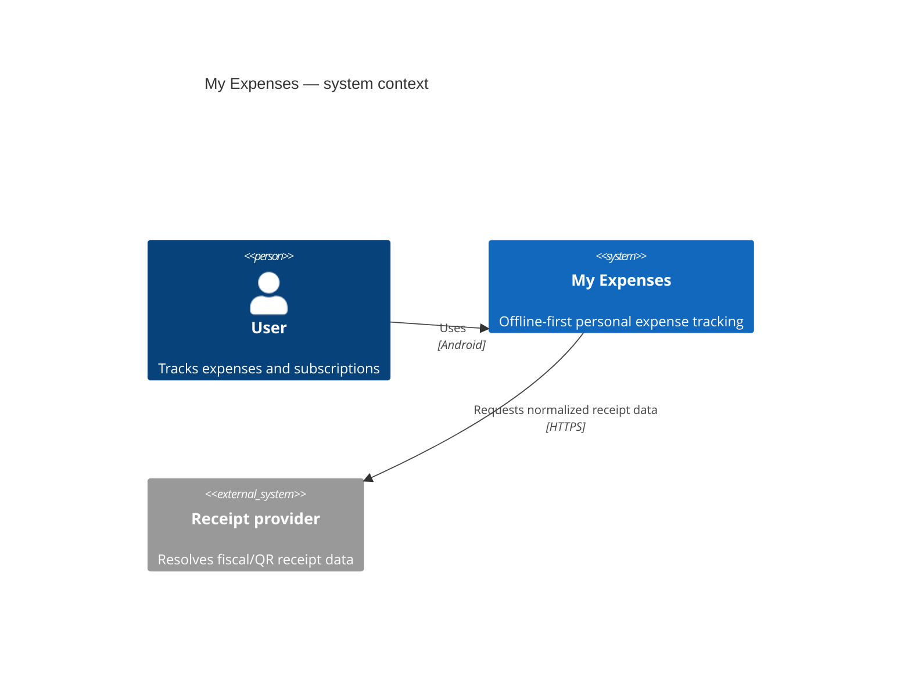
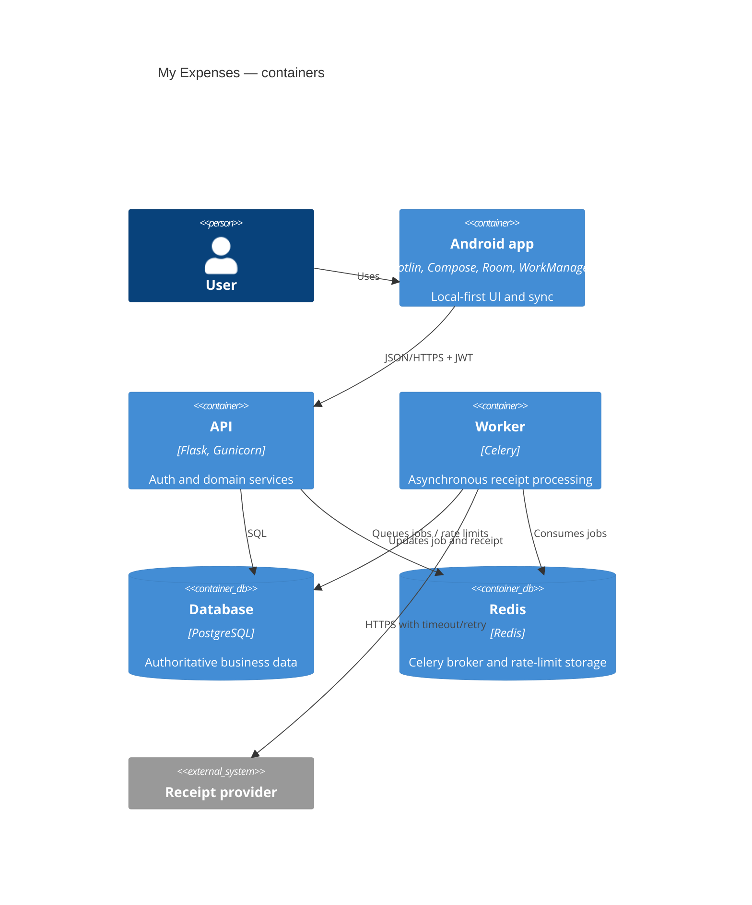

# System and container architecture

The Android application is the only end-user client. It communicates with the My Expenses API;
external receipt providers are reachable only from the backend.

In production, TLS termination and secret injection are deployment concerns outside this local
Compose topology. The API remains stateless except for PostgreSQL and Redis-backed state.
